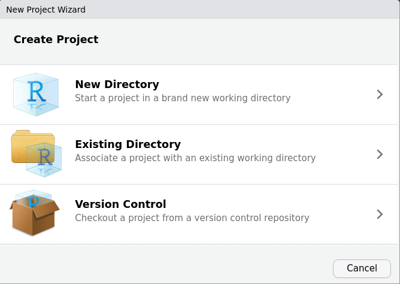
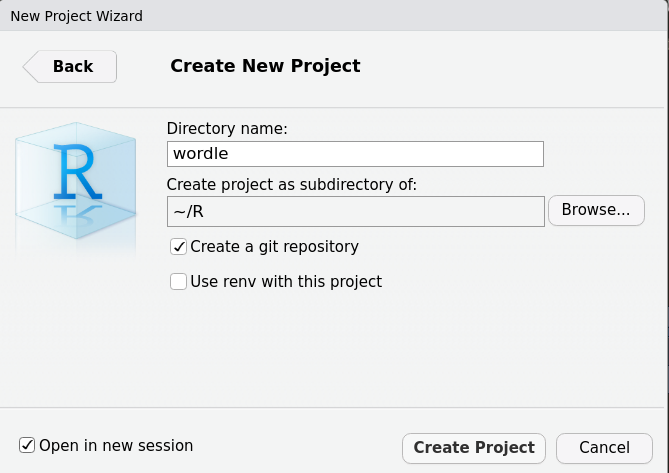
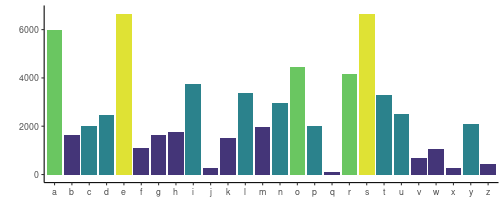
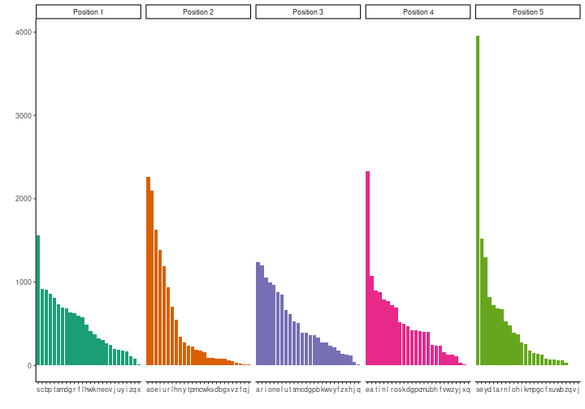

# Introduction

## Why use R to write reproducible articles?

Writing an entire article in R has a significant learning curve, but comes with many payoffs later down the line. For example, during the review process, analysis pipelines may change several times. This requires reported values and figures to be updated everywhere they appear, potentially leading to errors and discrepancies between the published results and the actual analysis that took place.

An article written in R can be published along with all the source code used to generate it, so that anyone can see exactly how you reached your results and reproduce everything for themselves, using either your data or their own. Whilst closed-source, proprietary software like MATLAB can be powerful tools in specific use-cases, they can present a significant roadblock to open science practices if used out of convenience rather than necessity.

## Some initial reproducibility tips

### `contents.R`

-   The main script in each project is `contents.R`

-   It is used to call all other project scripts in the correct order

    -   Running this script will run your entire analysis, even generating your figures and finished article if desired

    -   With descriptive filenames, it's easy to see what's going on in your analysis at a high level

-   Each script called by `contents.R` should be as self-contained as possible

    -   In practice, this means not calling functions and variables from other scripts, and tidying up unnecessary variables at the end of every script

-   Initially clearing memory is optional, but helpful to avoid accidentally writing code that depends on variables that aren't produced inside the project, or are used before assignment

### `setwd()` vs. R Projects

It is common to see R scripts start with a call to `setwd()`, setting R's working directory to the directory of the main script. Whilst this achieves the desired behaviour, it is far more optimal to create an R project instead.

-   `setwd()` usually uses a hard-coded directory specific to the user's machine
-   R projects are directory-agnostic and can store workspace images
-   Can set up git with an R project for integrated version control

### Loading libraries

-   `config/libraries.R` checks for required packages and installs any missing ones

-   It is useful to document which packages are used in which scripts, so that any redundant packages can be cleared out before making the code available to others

-   Packages like `renv` can be used in situations where reproducibility is critical

-   `renv` is similar to python's virtual environments `venv`, where dependencies are rolled up into a self-contained unit separate from the user's specific installation of R

-   This means the code is less likely to break if run on different machines with different versions of R and R packages

-   Note: `renv` uses static code analysis to detect package dependencies, so will not work with the custom package loading used in this project's `libraries.R` script; use `library()` instead

### Reading data

-   The `data/` folder contains any data files used in the project

-   This could be raw data which is then transparently cleaned in R, or -- in cases where this is not appropriate or feasible -- data that has been cleaned in a separate script/program (e.g., Fieldtrip)

-   `src/` is the source code folder where most of your scripts will live

-   The first script called after `config/libraries.R` is usually `src/read_data.R` to read all your raw data files into R

-   Depending on how much reformatting and cleaning is required, you may include a separate script (or even folder of scripts) dedicated to this, or simply do it all in `read_data.R` if there is only a trivial amount required

# Example Project: Recursive Wordle Solver

## Initial Setup

### Creating a new project

-   You can choose to start a project in a new or existing directory, or provide a URL to a repository hosted online (e.g., GitHub)

{width="494"}

-   This project was created in a new directory with a git repository setup alongside it

    -   It is also advisable to open in a new session to clear your workspace and any loaded packages

### {width="495"}

### Libraries


-    `tidyverse` is a collection of packages which greatly improve upon the basic functionality of R and is usually worth loading at the start of every new project

-   `magrittr` is a `tidyverse` package, but is not loaded by default when `library('tidyverse')` is called; it contains the very useful `%<>%` assignment pipe operator

### Word list


-   We first load the raw Wordle word list from `word_list.txt`

-   This list is then split into a character matrix for easier data handling

    -   Don't hard-code values! If they release Wordle 2 next week using 6+ letters instead of 5, this entire project should run without changing a single thing beyond the word list

## Letter Frequencies

-   We can use `knitr::kable()` to neatly format R data structures into tables


```r
source('src/frequency_tables.R')

# Create desired matrix
df = do.call(cbind, rev(frequencies))

# Format to table and add column names
knitr::kable(df, col.names = c(paste0('Position ', 1:n[2]), 'Total'))
```


|   | Position 1| Position 2| Position 3| Position 4| Position 5| Total|
|:--|----------:|----------:|----------:|----------:|----------:|-----:|
|a  |        737|       2263|       1236|       1074|        680|  5990|
|b  |        909|         81|        335|        243|         59|  1627|
|c  |        922|        176|        392|        411|        127|  2028|
|d  |        685|         84|        390|        471|        823|  2453|
|e  |        303|       1628|        882|       2327|       1522|  6662|
|f  |        598|         24|        178|        233|         82|  1115|
|g  |        638|         76|        364|        423|        143|  1644|
|h  |        489|        546|        120|        235|        370|  1760|
|i  |        165|       1383|       1051|        880|        280|  3759|
|j  |        202|         11|         46|         29|          3|   291|
|k  |        376|         95|        272|        503|        259|  1505|
|l  |        577|        699|        848|        771|        476|  3371|
|m  |        693|        188|        511|        402|        182|  1976|
|n  |        325|        345|        964|        788|        530|  2952|
|o  |        262|       2096|        993|        698|        389|  4438|
|p  |        859|        231|        364|        418|        147|  2019|
|q  |         78|         15|         13|          2|          4|   112|
|r  |        628|        940|       1198|        719|        673|  4158|
|s  |       1565|         93|        533|        516|       3958|  6665|
|t  |        815|        239|        616|        898|        727|  3295|
|u  |        189|       1187|        667|        401|         67|  2511|
|v  |        242|         52|        240|        156|          4|   694|
|w  |        413|        163|        271|        128|         64|  1039|
|x  |         16|         57|        133|         12|         70|   288|
|y  |        181|        271|        213|        108|       1301|  2074|
|z  |        105|         29|        142|        126|         32|   434|

```r
# Clean up
rm(df)
```

### Total Letter Frequencies



-   Here we have a plot of the letter frequencies for the entire Wordle word list

-   Any changes in the script will be updated in the plot next time

### Positional Letter Frequencies


